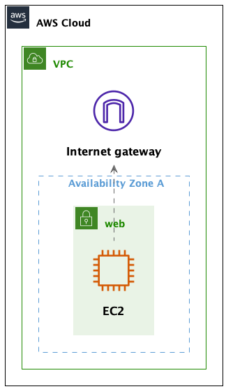

# Warsztaty AWS - 04 - ćwiczenie 2

##  Sieć publiczna

Po wykonaniu pierwszego ćwiczenia, masz juz VPC podzielone na podsieci,
szkielet sieci jest dobrze zaprojektowany.
W tym ćwiczeniu zmienimy nasze podsieci w tierze `web` w sieci publiczne.

### Utwórz jedną instancję w tierze `web`

2. Utwórz nową instancję
3. Wybierz obraz Ubuntu 
4. Wybierz typ instancji `t2.micro`
5. WAŻNE! Zamiast domyślnej, wybierz Twoją VPC i podsieć `web-a`

> Zwróć uwagę na atrybut Public IPv4 DNS w ustawieniach EC2.

Sprawdź połączenie przez SSH.

## Internet Gateway i Routing

Mamy już VPC i podsieci, ale nie mamy jeszcze połączenia z internetem.
Aby to zrobić, musimy utworzyć Internet Gateway i dodać go do naszego VPC.
A takze musimy dodać regułę routingu, która przekieruje ruch z podsieci `web` do Internet Gateway.

1. Przejdź do Internet Gateways w konsoli AWS
2. Utwórz nowy Internet Gateway
3. Przypisz go do naszego VPC
4. Wejdź do Subnets w zakładkę Route Table - zwróć uwagę, ze:

  * jest przypisana domyślna Route Table - Main
  * zwróć uwagę na Destination oraz Target 

5. Przejdź do Route Tables w konsoli AWS
6. Utwórz nową Route Table
7. Przypisz ją do naszego VPC
8. Przypisz utworzoną Route Table do podsieci z tierem `web`
9. Dodaj regułę routingu, która przekieruje cały domyślny ruch do Internet Gateway
  - destination: 0.0.0.0/0
  - pamiętaj o kolejności w jakiej sprawdzane są reguły routingu - najpierw local, potem inne(czyli nasz Internet Gateway)
  
10. Dodatkowa przydatna opcja - wejdź do każdej z podsieci tiera `web` i ustaw Auto-assign public IPv4 address.

### Zweryfikujmy czy nowe ustawienia działają 

Ponownie sprawdź czy możesz się połączyć z utworzoną instancją przez SSH.

### Widoczność publicznego adresu z poziomu EC2 

Będąc zalogowanym do naszej maszyny, wpisz komendę:
`ip a`

Zwróć uwagę na wartości:
- inet
- broadcast
- brak informacji o publicznym adresie