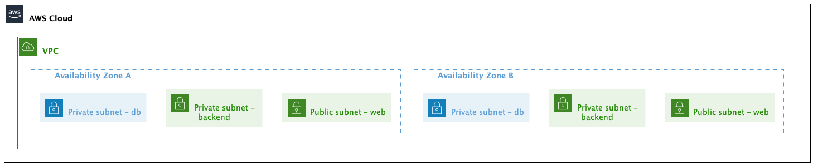

# Warsztaty AWS - 04 - ćwiczenie 1

Pobierz repo z warsztatami:

```
git clone -b 04 --single-branch 
```

## Projekt sieci

### 1. Odpowiedzmy na pierwsze pytanie - jakich adresów nie powinniśmy używać w naszej sieci? 

W czasach świetności Profil Software miał biura w trzech lokalizacjach (
Internet pamięta - https://web.archive.org/web/20190125005348/https://profil-software.com/):

- Gdynia office - sieć używa adresów z zakresu 192.168.0.0/16
- London office - sieć używa adresów z zakresu 
- Edinburgh office - 10.68.0.0/14

Załómy, ze mamy jescze dodatkowe sieci:
- Wirtualna sieć, w której działają sztandarowe projekty wewnętrzne firmy, która uzywa adresów 10.128.0.0/9
- planowane są dalsze integracje z innymi firmami, które mają własne sieci. Po wywiadzie z architekatmi z tych firm okazuje się, że sieci te używają adresów z zakresu  10.0.0.0/10


Przy uzyciu [kalkulatora](https://www.site24x7.com/tools/ipv4-subnetcalculator.html)
oblicz jakie są zakresy adresów w powyższych sieciach.
co pozwoli nam wyznaczyć jakich zakresów adresów powinniśmy unikać.

> Więcej o łączeniu sieci mozesz poczytać tutaj https://docs.aws.amazon.com/vpc/latest/peering/vpc-peering-basics.html


### 2. Ustalmy ile podsieci potrzebujemy.

W naszej sieci planujemy mieć:

- tier baz danych
- tier backend
- tier web

Aby zapewnić niezawodność i wydajność, 
każdy z tych tierów powinien być w osobnej podsieci
oraz powinny być one w różnych Availability Zones.

Na potrzeby wartsztatów uzyjmy dwóch Availability Zones

Aby zawęzić poszukiwania, użyjmy sieci zaczynającej się od 10.x.x.x

> Pamiętaj! Maksymalny rozmiar VPC to /16. 
Zakładając szybki rozwój firmy, uzyjemy maksymalnego rozmiaru, aby być gotowym na wszelkie ewentualności.


### 3. Tworzymy VPC i podsieci

1. Przejdź do VPC w konsoli AWS
2. Utwórz nowy VPC.

Teraz przejdź do Subnets i utwórz wymagane podsieci, zgodnie z powyższymi obliczeniami. 



Nazwy niech będą zgodne z następującym wzorcem:
`[tier]-[az]`
czyli dla tiera baz danych `db` w Availiability Zone Z A będzie to `db-a`

