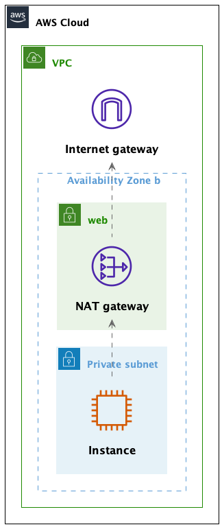

# Warsztaty AWS - 04 - ćwiczenie 4

## Sieć prywatna i NAT Gateway

W poprzednim ćwiczeniu udało nam się połączyć się z instancją w podsieci `backend` z instancji w podsieci `web`.

W tym ćwiczeniu spróbujemy otworzyć się na świat naszą sieć prywatną, ale w taki sposób, by nadal pozostała prywatna. 

Sprawdzimy tez połączenia pomiędzy sieciami publiczną i prywatną.


### Sprawdźmy teraz 4 scenariusze

- [X] połączenie z instancji w sieci publicznej z instancją w sieci prywatnej - to mamy juz sprawdzone
- [ ] połączenie z instancji w sieci publicznej z internetem
- [ ] połączenie z instancji w sieci prywatnej z internetem
- [ ] połączenie z instancji w sieci prywatnej z instancją w sieci publicznej

Wystarczy proste sprawdzenie przy uzyciu pinga,
np. `ping profil-software.com`

Zastanówmy się teraz, dlaczego niektórych scenariuszy nie mogliśmy zrealizować?


### Nat Gateway




Najpierw musimy utworzyć NAT Gateway w podsieci `public`.

Następnie utwórz nową tablicę routingu dla naszej Availability Zone.

Dodajmy do niej regułę routingu, która przekieruje ruch z podsieci `backend` do `NAT Gateway`.

Nastepnie musimy zmienić tablicę routingu dla podsieci `backend` i ustawić jej tablicę routingu na nową.

Teraz możemy sprawdzić, czy możemy się połączyć z internetem z instancji w podsieci `backend`.


### Flow logs (dodatkowe)

Wybierz podsieć web-a w konsoli AWS i włącz flow logs.
Logi będziemy zapisywać do CloudWatch Logs.
W tym celu musisz utworzyć rolę dla flow logs, aby miała dostep do CloudWatch Logs.

W tym celu przejdź do IAM, utwórz nową rolę
z następującym policy policy (trochę za szerokie) moe wygladać tak:
```
{
  "Version": "2012-10-17",
  "Statement": [
    {
      "Effect": "Allow",
      "Action": [
        "logs:CreateLogGroup",
        "logs:CreateLogStream",
        "logs:PutLogEvents",
        "logs:DescribeLogGroups",
        "logs:DescribeLogStreams"
      ],
      "Resource": "*"
    }
  ]
}
```

W trust policy ustaw: 
```
{
  "Version": "2012-10-17",
  "Statement": [
    {
      "Effect": "Allow",
      "Principal": {
        "Service": "vpc-flow-logs.amazonaws.com"
      },
      "Action": "sts:AssumeRole"
    }
  ]
} 
```

Teraz przejdź do CloudWatch Logs i utwórz nowy log group.

Teraz możesz włączyć flow logs dla podsieci `web` i wybrać utworzony log group.


Srpóbuj


## Jeśli nie przejdziemy do ćwiczenia 5, to  czyścimy całą infrasrukturę

Usuń wszystkie utworzone zasoby, aby za nie nie płacić :) 